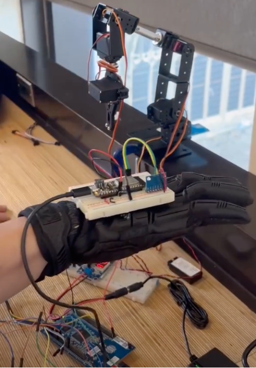
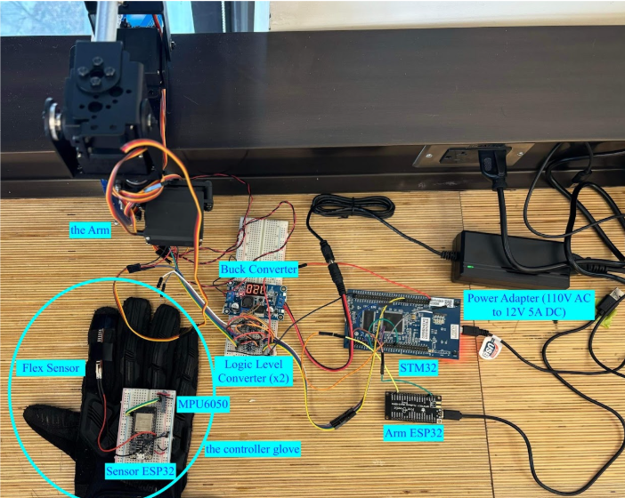
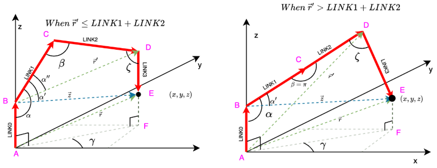
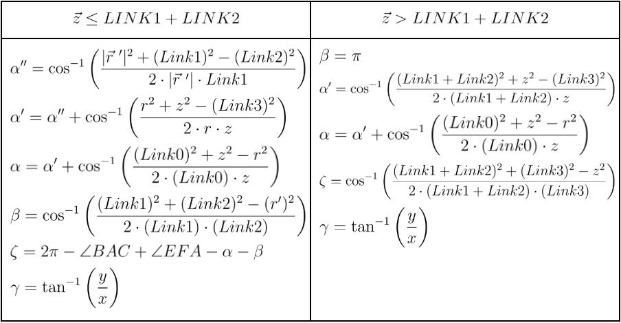
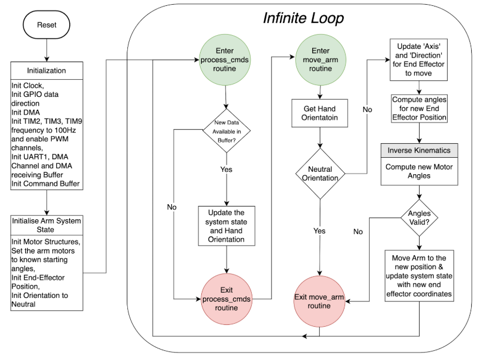

# Gesture-Controlled Robotic Arm

This repository contains the design, implementation, and documentation for a 5 Degree-of-Freedom (DoF) robotic arm controlled by a gesture-based glove. The project combines embedded systems, inverse kinematics (IK), and real-time motion control to achieve precise and responsive arm movements.
See the [Link Text](/MIE438 Project Report .pdf) for full details
- [Video Demonstration](https://www.youtube.com/watch?v=mmCg1Bn_yoI)
---

## Project Overview

### Objective
The primary goal was to create a robotic arm capable of interpreting human hand gestures to control its movement along three-dimensional axes. The project involved the integration of sensors, microcontrollers, and actuators, with an emphasis on efficient inverse kinematics computation and real-time performance.

### Features
- **Gesture-based control**: Hand gestures are captured using an accelerometer and flex sensor on a custom-designed glove.
- **Inverse Kinematics**: Smooth, linear arm motion achieved through optimized IK calculations.
- **Embedded System Integration**: Use of STM32 microcontroller for servo control and ESP32 for sensor data acquisition.
- **Real-time operation**: Motion computation and execution with minimal latency (updates every 5ms).

---

## System Architecture

### Hardware Components
1. **Robotic Arm**:
   - Actuated using 4 servo motors for 5 DoF motion.
   - Motion constrained to ±X, ±Y, ±Z directions.
2. **Glove Controller**:
   - Equipped with an MPU6050 (accelerometer) for orientation sensing.
   - Flex sensor for additional gesture differentiation.
3. **Microcontrollers**:
   - **STM32F429**: Handles IK calculations and PWM generation for servo motors.
   - **ESP32**: Collects sensor data and transmits it to STM32.
4. **Power Supply**:
   - 12V AC-DC converter with buck converter for servo motors.

### Software Components
1. **Inverse Kinematics (IK)**:
    
    
   - Computes joint angles based on target positions in 3D space.
   - Optimized using techniques like common subexpression elimination.
   - Python simulation used for prototyping and trajectory validation.
2. **Control Loop**:

   - Real-time operation with periodic updates (every 5ms).
   - Validates computed angles to ensure they are within joint constraints.
3. **Data Handling**:
   - UART and DMA for efficient communication between controllers.
   - Interrupt-driven design minimizes CPU usage.

---

## Project Implementation

### Hardware Integration
- **Servo Motor Control**:
  - Servo motors driven by PWM signals generated from STM32 timers.
  - Logic-level shifter used to amplify PWM signal for proper motor operation.
- **Sensor Data Acquisition**:
  - MPU6050 communicates with ESP32 via I2C.
  - Flex sensor output read as an analog signal by ESP32 ADC.

### Software Workflow
1. **Initialization**:
   - Configure MCU peripherals (timers, GPIO, DMA, UART).
   - Set initial angles and neutral positions for the arm.
2. **Gesture Interpretation**:
   - Hand orientation determined from accelerometer data.
   - Flex sensor used to differentiate gestures with similar accelerometer readings.
3. **Inverse Kinematics Execution**:
   - Compute new joint angles for the desired position.
   - Verify constraints before updating motor commands.

---

## Challenges and Solutions

1. **PWM Signal Voltage Mismatch**:
   - Used logic-level shifter to amplify 3V signals to 7.2V for servo motor operation.
2. **Efficient IK Calculations**:
   - Pre-computation and reuse of common variables reduced execution time.
3. **Testing and Debugging**:
   - Python-based simulation ensured logical correctness before hardware implementation.

---

## Results
- Successfully implemented a gesture-controlled robotic arm with smooth motion along linear axes.
- Demonstrated real-time performance and reliable communication between glove and robotic arm.
- Optimized embedded software for low latency and efficient computation.

---

## Future Improvements
- Add position feedback sensors (e.g., encoders) for closed-loop control.
- Improve gripper mechanism to enhance object manipulation capabilities.
- Expand gesture recognition with machine learning for more intuitive control.

---

## Resources
- [Video Demonstration](https://www.youtube.com/watch?v=mmCg1Bn_yoI)
---

## Authors
- Haoyang Deng
- Gurpreet Mukker
- Fangren Xu
